# Introduction

In this lab, you continue with the persona of Vijay.  Vijay is hopeful ADWC will save his team a huge amount of time and support new projects with aggressive timelines.  However he needs to test the assertion that ADWC can perform against large volumes of data.  To do that he has exported some data from his on-premise database [using data pump](https://docs.oracle.com/en/cloud/paas/autonomous-data-warehouse-cloud/user/load-data.html#GUID-30DB1EEA-DB45-49EA-9E97-DF49A9968E24), and has uploaded this to object storage and imported it into his new ADWC instance. 

Autonomous Data Warehouse Cloud provides three database services that you can choose when connecting to your database. These are named as HIGH, MEDIUM, and LOW services and provide different levels of performance and concurrency. 

The HIGH database service provides the maximum amount of resources for a query, this also means the number of concurrent queries you can run in this service will not be as much as the other services. 

The MEDIUM database service provides multiple compute and IO resources for a query. This service also provides more concurrency compared to the HIGH database service. 

The LOW database service provides the least amount of resources for a query, this also means the number of concurrent queries you can run in this service will  be higher than the other services. 

As a user you need to pick the database service based on your performance and concurrency requirements.  The differences between these service levels vary depending on the workload and particular query, but you might expect to see a query on the 'LOW' service run twice as fast on the 'HIGH' service.  In this lab we will use the 'HIGH' service.

Vijay has extracted the following data from their source operational system.  The first is order history going back five years.  The data scientist and marketing occasionally want to study medium to long term trends, and would use this data.
- SSB.DWDATE - 2556 rows
- SSB.SUPPLIER - 2,000,000 rows
- SSB.PART - 2,000,000 rows
- SSB.CUSTOMER - 30,000,000 rows
- SSB.LINEORDER - 6,000,000,000 rows

However they need near instant access to the current months data.
- ADMIN.DWDATE - 2556 rows
- ADMIN.SUPPLIER ~ 2,000,000 rows
- ADMIN.PART - 1,400,000 rows
- ADMIN.CUSTOMER - 6,200,000 rows
- ADMIN.LINEORDER - 100,000,000 rows
- ADMIN.CREDIT_SCORING_100K - 100,000 rows

To log issues and view the Lab Guide source, go to the [github oracle](https://github.com/oracle/learning-library/tree/master/workshops/adwc4dev) repository.

## Objectives
-   Test query access to current data to confirm the feasibility of letting end users slice and dice the data for ad-hoc analysis.
-   Test query access to a much larger historical data set to confirm the feasiblity of analyzing historical data sets.

## Required Artifacts
-	The following lab requires an Oracle Public Cloud account. You may your own cloud account, a cloud account that you obtained through a trial, or a training account whose details were given to you by an Oracle instructor.
-	Oracle SQL Developer (see Lab100 for more specifics on the version of SQL Developer and how to install and configure it).

# Performance Tests

## Run Queries Against Current Orders
As noted above, Vijay wants to ensure end users using a variety of tools can run queries against 100M current orders (with 1.4M parts, 6M customers, and 2M suppliers) that take no more than a few seconds.  He also will test this with no tuning whatsoever, and will query the data set different ways to confirm performance holds regardless of how the data is accessed.  Note your results (row counts) may vary.

### **STEP 1: Connect to ADWC with SQLDeveloper**
- Open the ADWC-Trial Admin connection you created at the end of Lab 100.
  

- Expand the tables
  

### **STEP 2: Run queries**
- Enter the following.  This first flushes the result cache, and then runs a typical aggregate query.
```
exec DBMS_RESULT_CACHE.flush;

set pagesize 1000;

select d_month, d_monthnuminyear
, sum(lo_revenue)
from lineorder_100M
, dwdate
where lo_orderdate = d_datekey
group by d_month, d_monthnuminyear
order by d_monthnuminyear
```
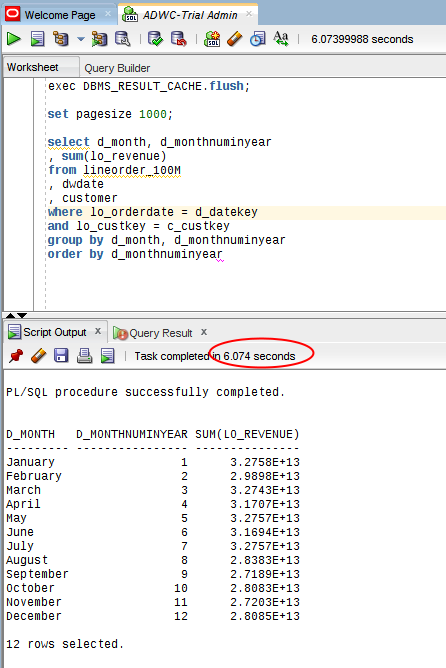

-	Note the query takes about six seconds to query and summarize 100M orders.
-	We now want to see if others who also run the same or similar queries use the results which are now cached.  This saves a huge amount of processing since the database just needs to retrieve the cached results.  Enter the following.  This is the same query as above, but does not clear the cache.  You may wish to first clear the previous result.
```
select d_month, d_monthnuminyear
, sum(lo_revenue)
from lineorder_100M
, dwdate
where lo_orderdate = d_datekey
group by d_month, d_monthnuminyear
order by d_monthnuminyear
```
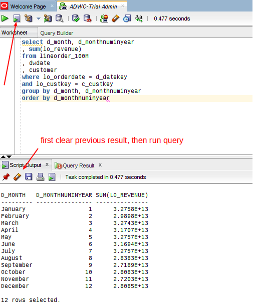

- Note the query now takes less than half a second to run.
- Next query by nation and then year, and filter by region.  Enter the following.
```
select c_nation
, d_month
, sum(lo_revenue) as revenue
from customer, lineorder_100M, dwdate
where lo_custkey = c_custkey
and lo_orderdate = d_datekey
and c_region = 'AMERICA'
group by c_nation
, d_month
order by revenue desc;
```
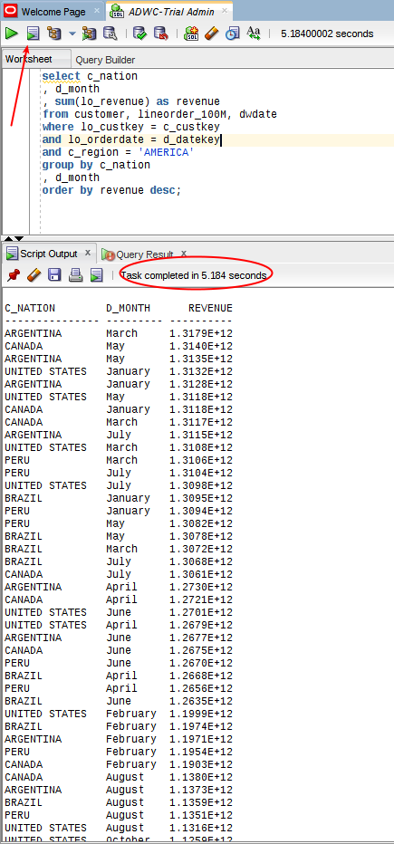

- Again the query took about five seconds, while grouping by month and nation, and sorting by revenue descending.
- What about a more selective query?  Execute the following.
```
select d_date
    , p_partkey
    , p_name
    , p_color
    , sum(lo_quantity) quantity
    , sum(lo_revenue) revenue
    , sum(lo_supplycost) supplycost
    , sum(lo_revenue-lo_supplycost) profit
from lineorder_100m
, DWDATE
, part
where p_partkey = lo_partkey
and d_datekey = lo_orderdate
and d_yearmonth = 'Sep1996'
AND d_dayofweek = 'Friday   '
AND p_color in ('ivory','coral')
and lo_orderpriority = '1-URGENT'
group by d_date
, p_partkey
, p_name
, p_color
```
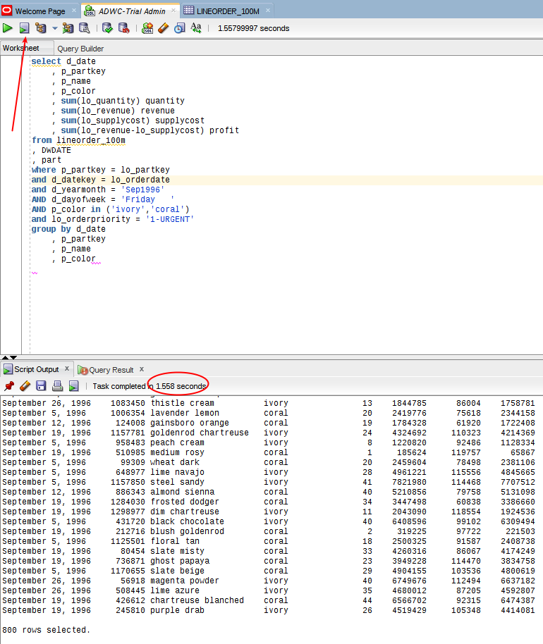

- Note it takes less than 1.5 seconds to retrieve 800 rows, without any indexes, pre-sorting, or pre-load processing.

## Run Queries Against Order History
Vijay now feels confident that users hitting current closed orders will be happy with the response time, regardless how they query the data.  The order history is 60x larger, with 6B rows in the order history table (and 30M customers).  The business case to provide ad-hoc access to this volume of data relates to the data scientists, who are interested in uncovering long term patterns over time.  They are a smaller group that have spent weeks in the past extracting and pre-processing the data.  They are excited at the prospect of getting immediate access to real time data and having the ability to get results in a couple of minutes rather than a painful multi-week process.

### **STEP 3: Run historical queries**
- Clear the result cache to ensure you are getting an accurate measure of database performance, and then run the following query.  Enter the following in SQLDeveloper.
```
exec DBMS_RESULT_CACHE.flush;

select d.d_date
    , p.p_partkey
    , p.p_name
    , p.p_color
    , sum(l.lo_quantity) quantity
    , sum(l.lo_revenue) revenue
    , sum(l.lo_supplycost) supplycost
    , sum(l.lo_revenue-l.lo_supplycost) profit
from ssb.lineorder l
, SSB.DWDATE d
, ssb.part p
where p.p_partkey = l.lo_partkey
and d.d_datekey = l.lo_orderdate
and d.d_yearmonth = 'Aug1996'
AND d.d_dayofweek = 'Friday   '
AND p.p_color in ('ivory','coral')
group by d.d_date
    , p.p_partkey
    , p.p_name
    , p.p_color;
```
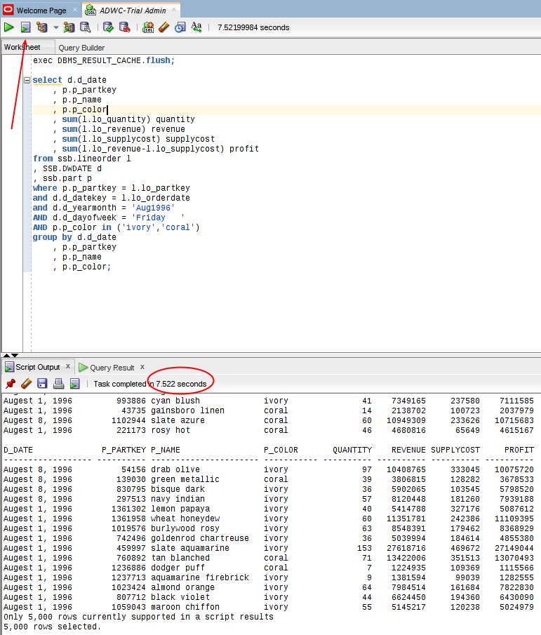

- Vijay was surprised to see that the execution time to retrieve the first 5000 rows was again only a few seconds.
- Vijay has requests from analysts about support for analytic queries.  The analysts have started to use these views in their on-premise Oracle Database, and have found them to be fast and suited to the historical type queries they typically run.  To test this expand 'Other Users in your connection.

  

- Scoll down and expend Analytic Views.

  

- Now run the following analytics query.
```
SELECT
  dwdate_hier.member_name as year,
  part_hier.member_name as part,
  customer_hier.c_region,
  customer_hier.member_name as customer,
  lo_quantity,
  lo_revenue
FROM  ssb.ssb_av
  HIERARCHIES (
    dwdate_hier,
    part_hier,
    customer_hier)
WHERE
  dwdate_hier.d_year = '1998'
  AND dwdate_hier.level_name = 'MONTH'
  AND part_hier.level_name = 'MANUFACTURER'
  AND customer_hier.c_region = 'AMERICA'
  AND customer_hier.level_name = 'NATION';
```
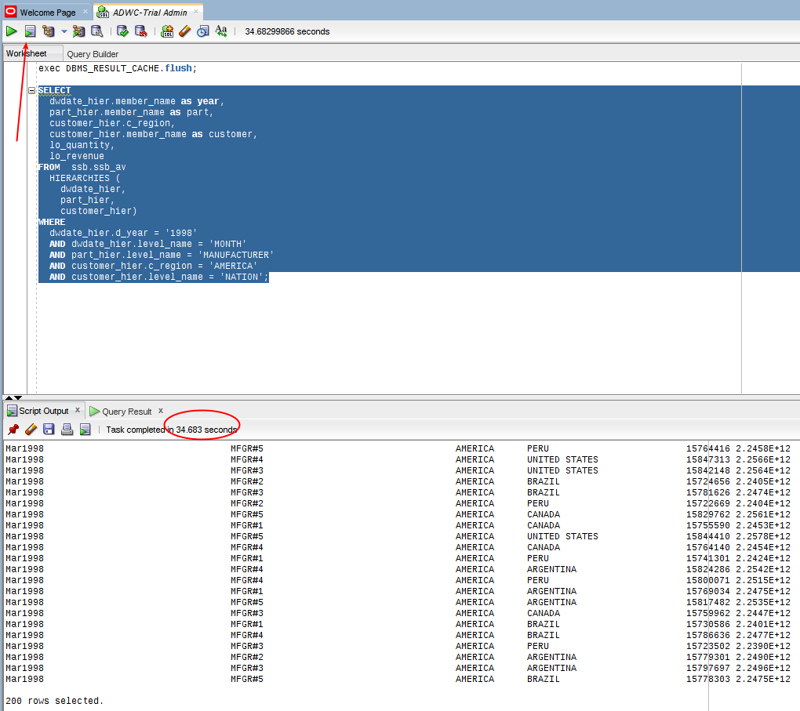

- In this particular case the query took a bit longer (35 seconds), but was still extremely fast, and now offers analtytic support they never had before.

- Finally, what about a simple query to retrieve a single orderkey, realizing again there are no indexes on the table.  Enter the following.
```
select * from ssb.lineorder where lo_orderkey = 1174002208;
```
  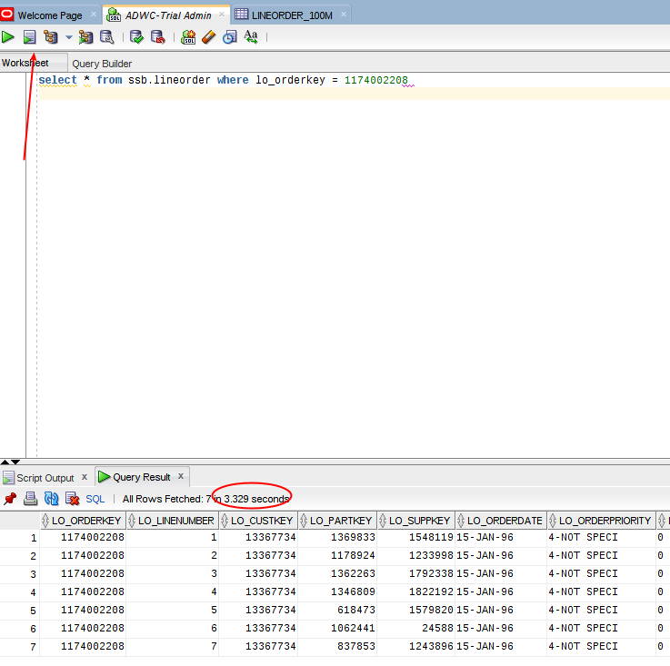

Note: Some queries may take two-three minutes (but no more), depending on how many rows are processed and returned, and the aggregation level.  These are not included so that the lab can proceed without delay.

## Review Database Activity

### **STEP 4: Log into the Cloud Console.**
- Log into the Cloud Console and select ADWC, and then open the Service Console.

  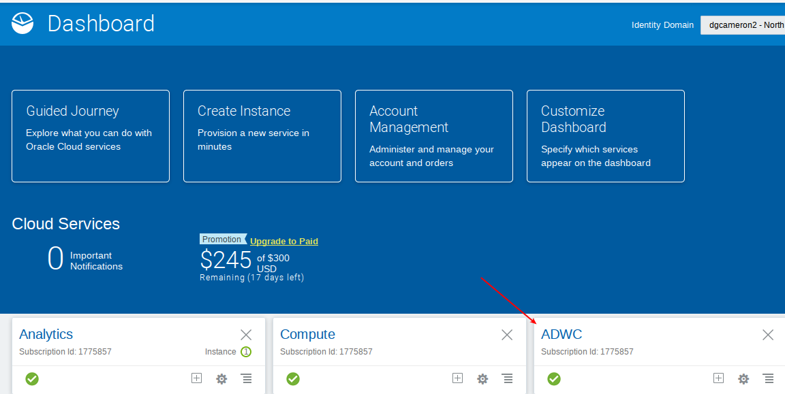

  

- Select your database ADW, and then the ADWC Service Console.

  

  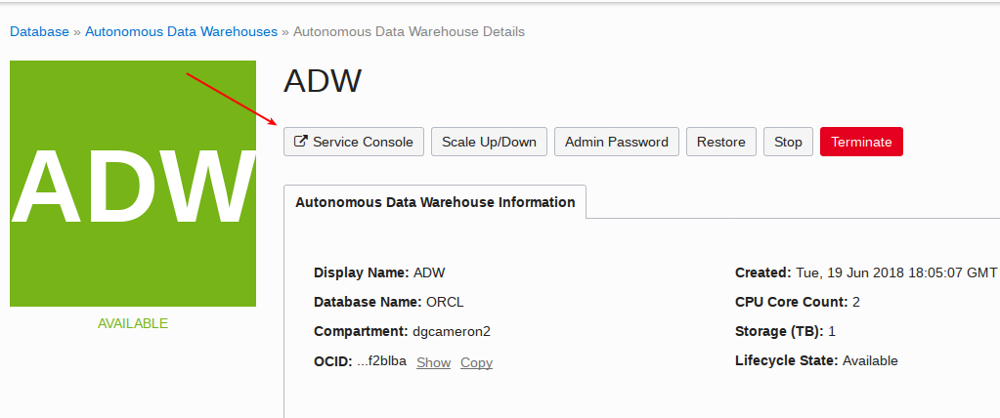

- Log in as the admin user, with your admin password (`Alpha2018___`)

  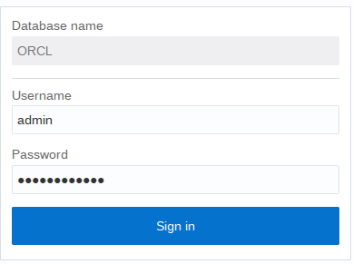

- Select `Activity`.

  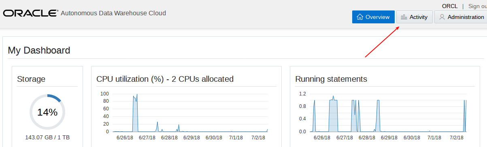

- Here you get an overview of the database activity, CPU utilization, and running statements.

  

- Select Monitored SQL.

  

- Here you can review details about the statements you have issued.  While this lets you what is happening, you will not need this to tune the database, as it is self-tuning.  Scroll to the right for more information.  You can also select different metrics.

  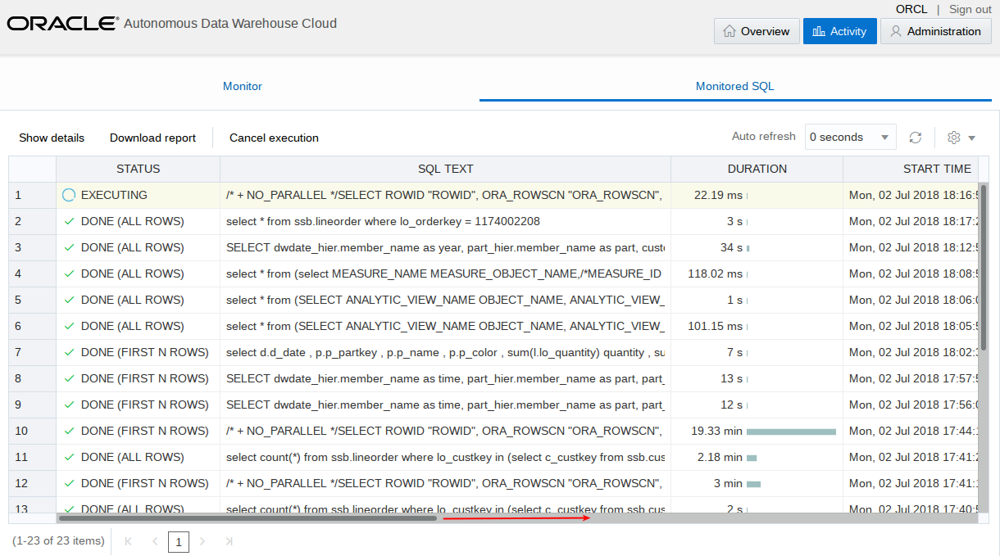

  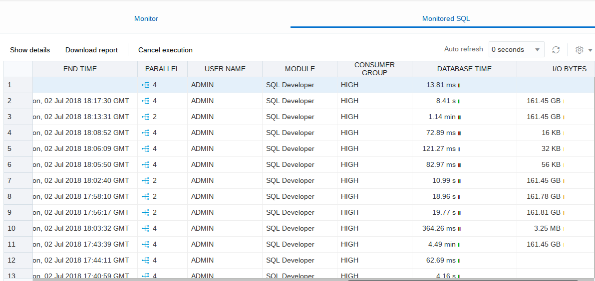

  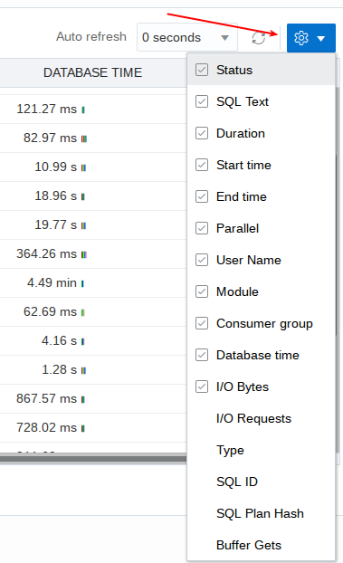

### **STEP 5: Scale the database.**
- Go back to the ADW console and select `Scale Up/Down`.

  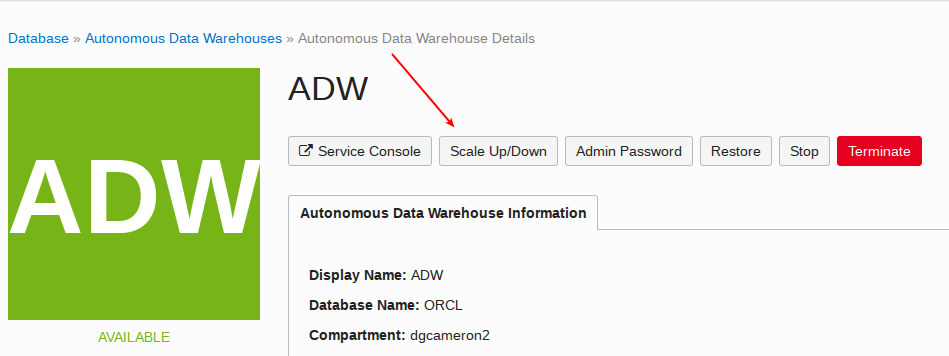

- Review the options.  We will leave these as is.  If/when you change the parameters the instance applies the changes while online, without dropping connections, and transparently to users logged in and querying the database.  Close the window.

  

## Conclusion

Vijay is now confident that ADWC is a much better alternative performance wise to the other major cloud vendor.  He can scale storage and compute resources up or down without downtime, and is now ready to let the data scientists access the data to run machine learning models for the marketing project.

You have completed lab 200 and can move on to lab 300.