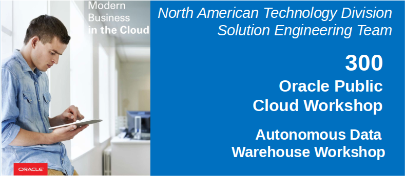

Update: July 2, 2018

# Introduction
in this lab you will assume the persona of Heather, the data scientist/ML expert for Alphaoffice.  Heather has spent most of her time over the past couple of years extracting and preparing data for analysis.  The large volumes of data need extracting and processing mean she spends most of her time waiting for jobs to finish and very little of her time analyzing the data.  Demands from marketing are forcing a new approach whereby the data remains in the data warehouse and is processed there.  The alternative cloud solution is more complex, and has no direct out of the box processes to analyze the data in place.  She started taking a look at Oracle, and found the simple SQL commands in ADWC are familiar, and execute extremely fast, leveraging all the performance features of the platform.  Further once she is done can can apply the learning models to incoming data on the fly, and allow end user analysts to immediately see mining results.  This drastically reduces the cycle of data preparation, analysis, and publishing.  It also means there is no change to analysis/reporting Data Visualization toolset that users are familiar with.

An added benefit is the ability to use a new open source [Apache Zeppelin based collaboration environment](http://www.oracle.com/technetwork/database/options/oml/overview/index.html) where she can work with others on the team in real time, annotating ML steps and combining the processing and documentation in one place.  Since we are going to use Oracle ML interface, much of the lab will be done in that interface.  For more information on which Machine Learning Algorithms are supported see [Oracle Advanced Analytics documentation](https://docs.oracle.com/en/database/oracle/oracle-database/12.2/dmapi/mining-fuctions.html#GUID-3BC8FD92-9B6A-4612-A458-7E5FFDDC5EA7).

## Objectives
- Import a Apache Zepplin notebook.
- Become familiar with Oracle Machine Learning Algorithms.
- Create a machine learning model to determine factors that predict good credit.

## Required Artifacts
- Oracle SQL Developer (see Lab 100 for more specifics on the version of SQL Developer and how to install and configure it).

# Steps

## Upload Credit Score Data to Object Storage

### **STEP 1: Sign in to Oracle Cloud**

- If you have not already done so, log in.

  

  

  

- Select Compute.

  

  

### **STEP 2: Create bucket adwc and upload your data**

- Select the drop down menu in the upper left.

  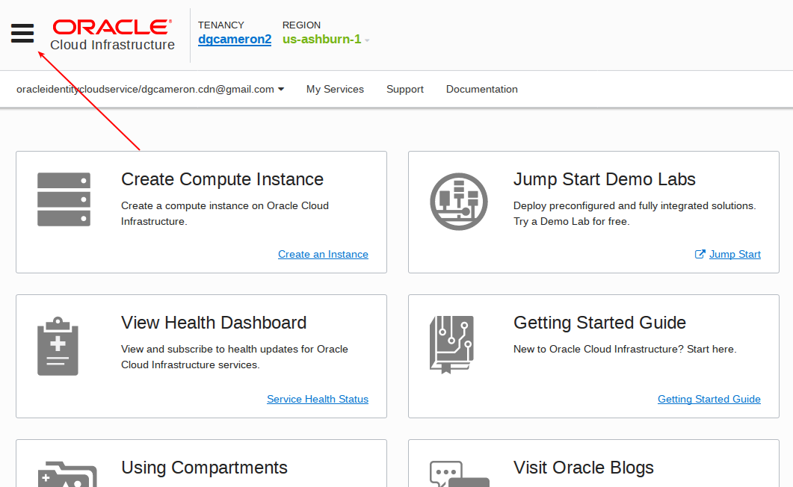

- Scroll down and select Object Storage.

  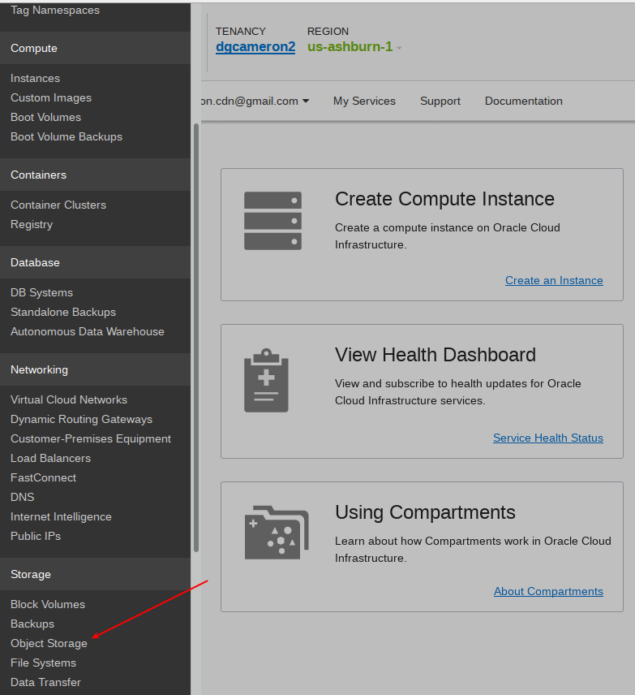

- Create a bucket called `adwc`.  Create the bucket in your compartment (not ManagedCompartmentForPaas).

  

  

- Select the `adwc` bucket and upload file `credit_scoring_100k` in git directory `ADWC4Dev/workshops/adwc4dev/install`.

  

  

  

  

  

- Construct a URL for the file in Object Storage.  This will be used in SQLDeveloper to import the file into a database table.  The URL is structured as follows. The values for you to specify are in brackets.  Save this to a notepad for use in the following steps.

`https://swiftobjectstorage.<region_name>.oraclecloud.com/v1/<tenant_name>/<bucket_name>/<file_name>`

eg:  `https://swiftobjectstorage.us-ashburn-1.oraclecloud.com/v1/dgcameron2/adwc/credit_scoring_100k.csv`

  

  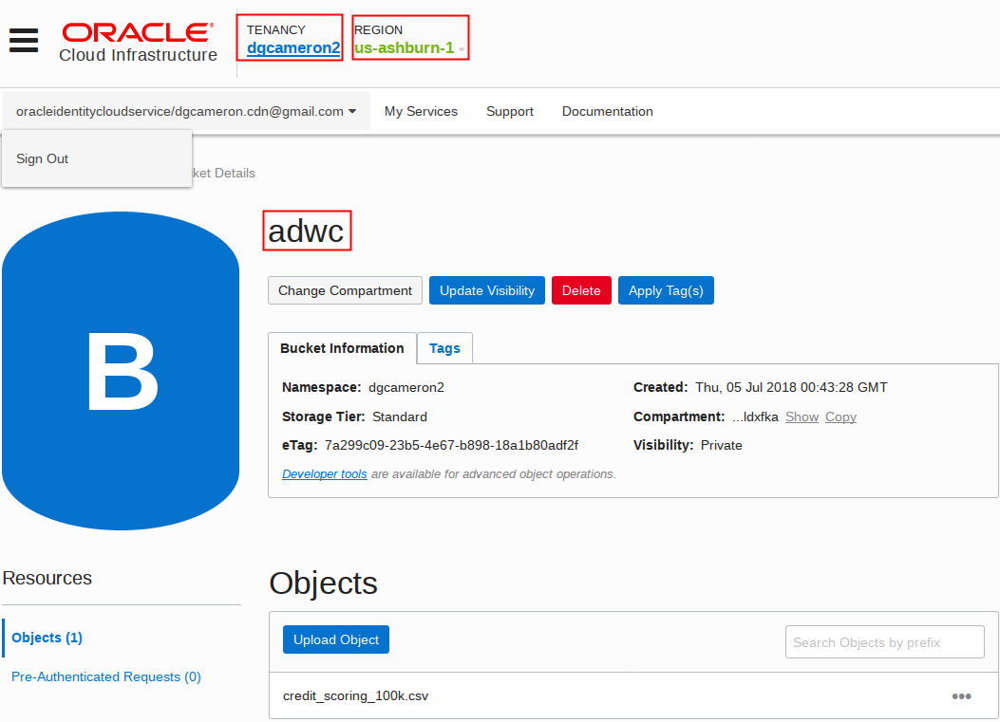

- To load data from the Oracle Cloud Infrastructure(OCI) Object Storage you will need an OCI user with the appropriate privileges to read data (or upload) data to the Object Store. The communication between the database and the object store relies on the Swift protocol and the OCI user Auth Token.  Go back to the menu in the upper left and select users.

  

- Click the user's name to view the details. Also, remember the username as you will need that in the next step.

  

- On the left side of the page, click Auth Tokens, and then `Generate Token`.  Call it `adwc token`.  Be sure to copy it to a notepad.

  

  

  

  

### **STEP 3: Create a Database Credential for Your User**
- To access data in the Object Store you have to enable your database user to authenticate itself with the Object Store using your OCI object store account and Auth token. You do this by creating a private CREDENTIAL object for your user that stores this information encrypted in your Autonomous Data Warehouse. This information is only usable for your user schema.

- Connected as your user in SQL Developer, copy and paste this to SQL Developer worksheet.  Specify the credentials for your Oracle Cloud Infrastructure Object Storage service: The username will be the OCI username (which is not the same as your database username) and the OCI object store Auth Token you generated in the previous step. In this example, the crediential object named OBJ_STORE_CRED is created. You reference this credential name in the following steps.

- Paste the following into SQLDeveloper.
```
BEGIN
  DBMS_CLOUD.CREATE_CREDENTIAL(
    credential_name => 'adwc_token',
    username => '<your cloud username>',
    password => '<generated auth token>'
  );
END;
/
```
  

- Now you are ready to load data from the Object Store.

### **STEP 4: Loading Data Using the Data Import Wizard in SQL Developer**

- First create your table.  Enter the following in SQLDeveloper.
```
create table admin.credit_scoring_100k 
   (	customer_id number(38,0), 
	age number(4,0), 
	income number(38,0), 
	marital_status varchar2(26 byte), 
	number_of_liables number(3,0), 
	wealth varchar2(4000 byte), 
	education_level varchar2(26 byte), 
	tenure number(4,0), 
	loan_type varchar2(26 byte), 
	loan_amount number(38,0), 
	loan_length number(5,0), 
	gender varchar2(26 byte), 
	region varchar2(26 byte), 
	current_address_duration number(5,0), 
	residental_status varchar2(26 byte), 
	number_of_prior_loans number(3,0), 
	number_of_current_accounts number(3,0), 
	number_of_saving_accounts number(3,0), 
	occupation varchar2(26 byte), 
	has_checking_account varchar2(26 byte), 
	credit_history varchar2(26 byte), 
	present_employment_since varchar2(26 byte), 
	fixed_income_rate number(4,1), 
	debtor_guarantors varchar2(26 byte), 
	has_own_phone_no varchar2(26 byte), 
	has_same_phone_no_since number(4,0), 
	is_foreign_worker varchar2(26 byte), 
	number_of_open_accounts number(3,0), 
	number_of_closed_accounts number(3,0), 
	number_of_inactive_accounts number(3,0), 
	number_of_inquiries number(3,0), 
	highest_credit_card_limit number(7,0), 
	credit_card_utilization_rate number(4,1), 
	delinquency_status varchar2(26 byte), 
	new_bankruptcy varchar2(26 byte), 
	number_of_collections number(3,0), 
	max_cc_spent_amount number(7,0), 
	max_cc_spent_amount_prev number(7,0), 
	has_collateral varchar2(26 byte), 
	family_size number(3,0), 
	city_size varchar2(26 byte), 
	fathers_job varchar2(26 byte), 
	mothers_job varchar2(26 byte), 
	most_spending_type varchar2(26 byte), 
	second_most_spending_type varchar2(26 byte), 
	third_most_spending_type varchar2(26 byte), 
	school_friends_percentage number(3,1), 
	job_friends_percentage number(3,1), 
	number_of_protestor_likes number(4,0), 
	no_of_protestor_comments number(3,0), 
	no_of_linkedin_contacts number(5,0), 
	average_job_changing_period number(4,0), 
	no_of_debtors_on_fb number(3,0), 
	no_of_recruiters_on_linkedin number(4,0), 
	no_of_total_endorsements number(4,0), 
	no_of_followers_on_twitter number(5,0), 
	mode_job_of_contacts varchar2(26 byte), 
	average_no_of_retweets number(4,0), 
	facebook_influence_score number(3,1), 
	percentage_phd_on_linkedin number(4,0), 
	percentage_masters number(4,0), 
	percentage_ug number(4,0), 
	percentage_high_school number(4,0), 
	percentage_other number(4,0), 
	is_posted_sth_within_a_month varchar2(26 byte), 
	most_popular_post_category varchar2(26 byte), 
	interest_rate number(4,1), 
	earnings number(4,1), 
	unemployment_index number(5,1), 
	production_index number(6,1), 
	housing_index number(7,2), 
	consumer_confidence_index number(4,2), 
	inflation_rate number(5,2), 
	customer_value_segment varchar2(26 byte), 
	customer_dmg_segment varchar2(26 byte), 
	customer_lifetime_value number(8,0), 
	churn_rate_of_cc1 number(4,1), 
	churn_rate_of_cc2 number(4,1), 
	churn_rate_of_ccn number(5,2), 
	churn_rate_of_account_no1 number(4,1), 
	churn_rate__of_account_no2 number(4,1), 
	churn_rate_of_account_non number(4,2), 
	health_score number(3,0), 
	customer_depth number(3,0), 
	lifecycle_stage number(38,0), 
	credit_score_bin varchar2(100 byte)
   );

	 grant select any table to public;
```
  

- Right click on the Tables to refresh the table list.

  

- Right click on the `credit_scoring_100k` table and import.

  

- Select `Oracle Cloud Storage` as the source, enter the `swiftobjectstorage` URL you copied to notepad above, and select `ADWC_TOKEN`, and then select the `Preview` button and then `Next` button.

  

- Take the remaining defaults.

  

  

  

  

  

- The import should only take a few seconds.  When it is complete you will see the following.

  

- Click on the table on the left and select the data tab to review the data.

  

## Log into Oracle Machine Learning

Now that Heather has loaded the data, she will log into the Oracle Cloud Console, and then into Machine Learning.

### **STEP 1: Sign in to Oracle Cloud**

- If you have not already done so, log in.

  

  

  

- Select ADWC

  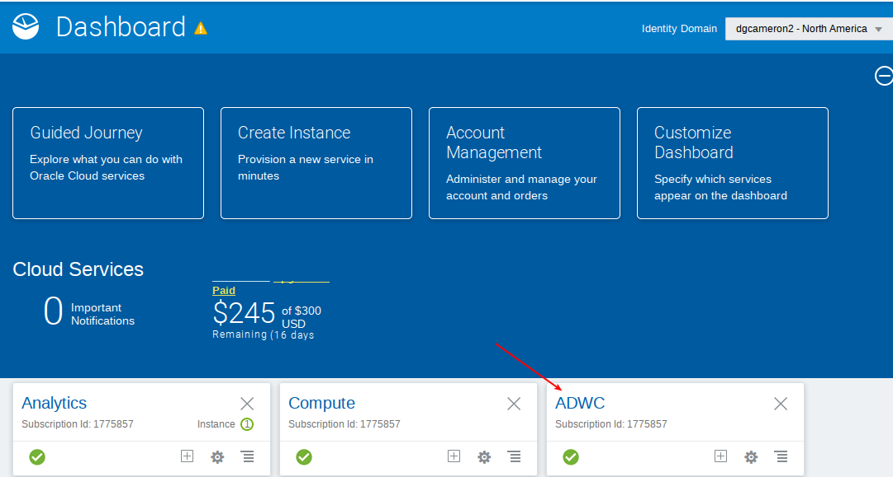

  

- Select the ADW database.

  

  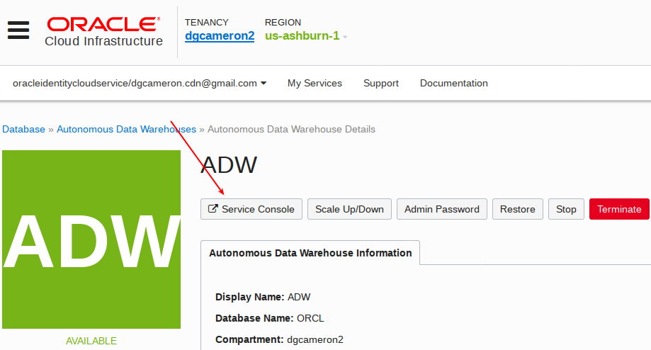

- Enter the admin user.

  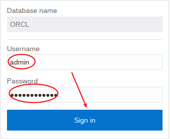

- Select Administration

  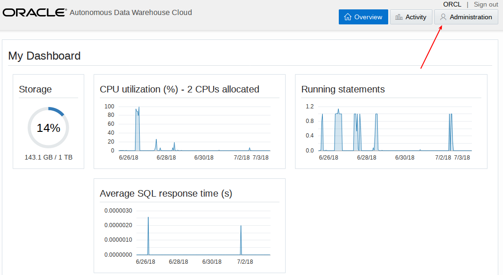

- select `Manage Oracle ML Users`.

  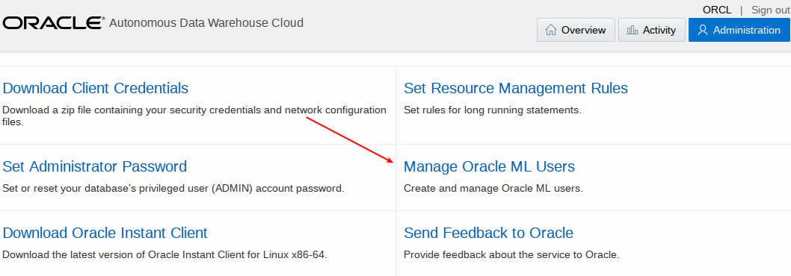

  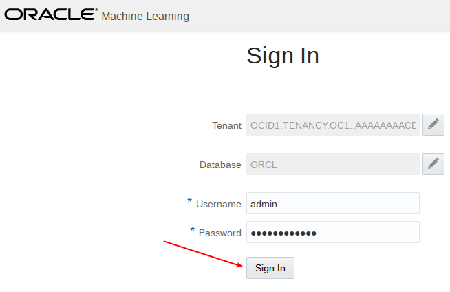

- Create new ML user.  Enter user `adwc_ws` with password `Alpha2018___`.

  

  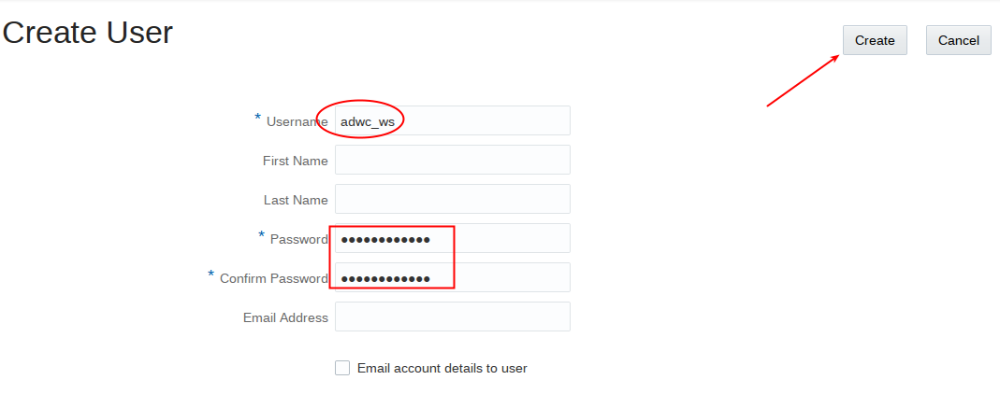

- Select the home icon upper right.

  

- Log in as `adwc_ws` password `Alpha2018___`.  Before you log in you may wish to bookmark this page.

  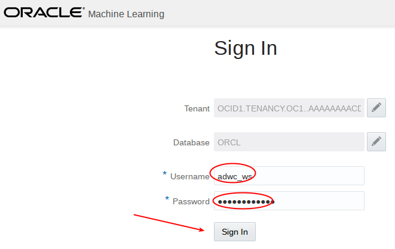

- Navigate around to get familiar with the ML pages.  Click on Examples.

  

- Note the various ML notebook examples.  Feel free to review some of these.  We will be creating a new ML notebook in this lab.

  

- Click on the upper left icon to bring back the menu.  Then select `Notebooks`.

  

  

- We will be importing a pre-built notebook, and using this for the remainder of the lab.  Select `Import`.

  

- Go to the `install` directory in your git repository and import the `Credit Score Predictions.json` notebook.

  


- Select the `Credit Score Predictions` notebook.

  

- Before you start working with the `Credit Score Predictions` you need to set the interpreter binding.  Click on the gear icon.

  

- Select the `orcl_high` interpreter and then Save.

  

The rest of this lab will be done interactively in the notebook.  The following area just screen shots for your convenience.

## Screen Shots of ML Notebook

  

  

  

  

  

  

  

  

  

  

  

  

  

  

  

  

  