# Introduction
In this Lab you will assume the persona of Emma, the marketing analyst.  She will be using Oracle Advanced Analytics to review current and historical sales patterns, and use the results of Heather's (data scientist) machine learning to support a new marketing project that targets high value/high credit customers.  She is working with others on her team, some of which have already been using Oracle Advanced Analytics to review sales data.  She wants to review the Data Visualization content before creating some insights herself.  She will begin by importing content from another analyst and reviewing sales perspectives, and will then build out visualizations on the sales credit machine learning results that were created by Heather.

In Lab 100 you created an Oracle Machine Learning instance as part of the setup, and then went on to the rest of Lab 100.  The instance should now be available.

To log issues and view the Lab Guide source, go to the [github oracle](https://github.com/oracle/learning-library/tree/master/workshops/adwc4dev) repository.

## Objectives
- Log into Oracle Advanced Analytics and import the Sales.dva project.
- Review the pre-built dashboards that sales information for the past four years.
- Upload your ADWC wallet and create a new ADWC connection.
- Create new credit_scoring_100k datafile.
- Create content on credit scoring data

## Required Artifacts
- A Trial Account

# Steps

## Review Sales History

### **STEP 1: Sign in to Oracle Advanced Analytics and import the Sales.dva project.**

- You should already be familiar with the Cloud Console Login.  After logging in you land on the Dashboard.  Select `Autonomous Analytics`.

  

  

- Click on the menu on the far right and select `Oracle Analytics Cloud URL`.

  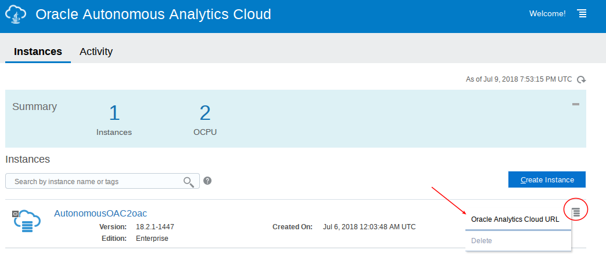

- You end up on the main OAC page.  Click on the menu in the upper right to expand the menu.

  

- We will create a new project by importing and existing saved project.  Select `Project` on the left.

  

- Select `Projects` in your current workspace.

  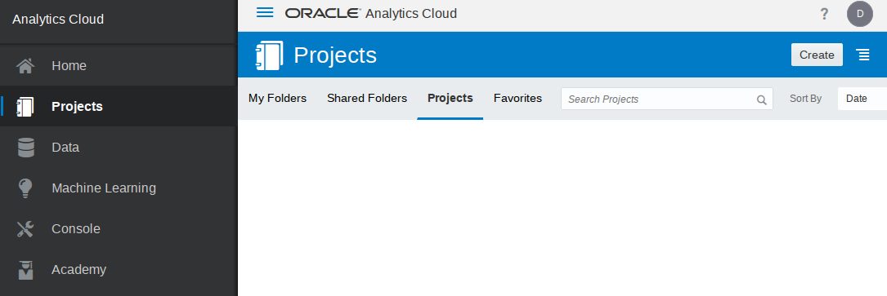

- Select `import` from the menu in the upper right.

  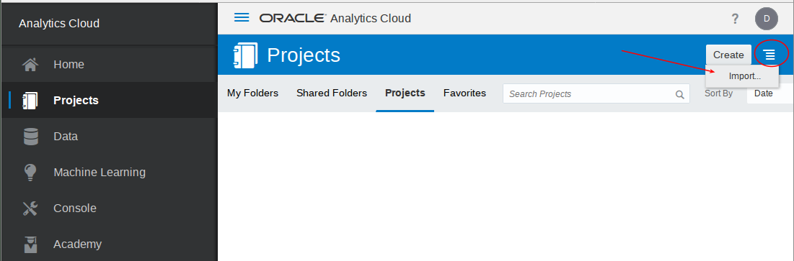

- Select Sales.dva files from the `install` directory in git and import.  The password is `Admin123`.

  

  

  

  

### **STEP 2: Review the pre-built dashboards that sales information for the past four years.**

- Select the imported project `Sales History`.

  

- Review content created and shared by the marketing analyst.  Note that we are viewing the `Visualize` perspective.  There is also the `Prepare` and `Narrate` perspectives.  Select the `Narrate` perspective.

  

- Page through the canvasses left to right.  Note that Customer Profitabliity is of particular interest to Emma as it relates to her new marketing project.  As Emma is new to OAC this is a good way to get a feel for the different visualizations.

  

  

  

- When she lands on the `Performance` canvass she hovers over some of the various offices.  Vancouver has 117 offices while Victoria has 119 offices, but is far less profitable.  This region will be the initial focus of the marketing campaign.  She makes a note to Heather to talk about future machine learning analysis to learn why this might be.

  

- Create a new note for Heather - select the note icon.  Enter `Hey Heather, can you take a look at these offices and learn why the profit varies so much independent of the customer base?`.

  

- Select the remaining canvasses.

  

  

- She notes there are a couple of other interesting canvasses that were created but not selected.  Drag and drop the `Top Countries` and `Diagram` canvasses to the bottom.
 

  

### **STEP 3: Upload your ADWC wallet and create a new ADWC connection.**

- When you opened the project a new browser tab was created.  Go back to the initial OAC tab and then select the `Console` on the left.

  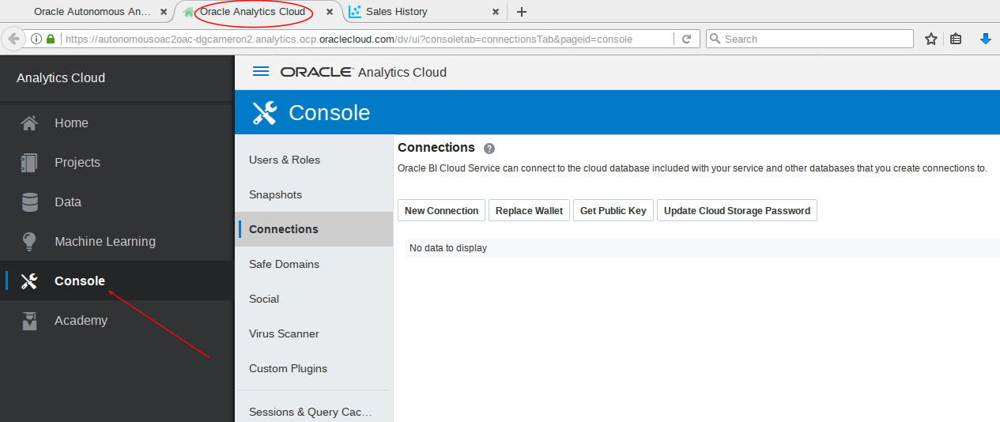

- Select `Connections`, and then `Upload Wallet`.  If you have previously uploaded a wallet it will say `Replace Wallet`.  Select `Proceed without a virus scanner`. 

  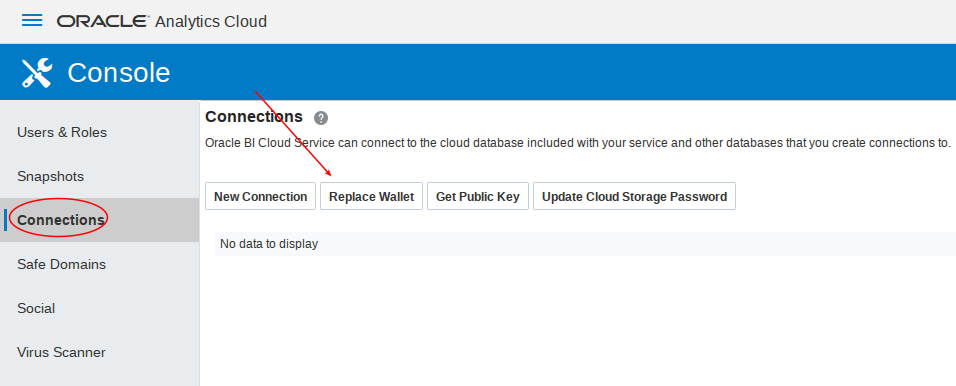

  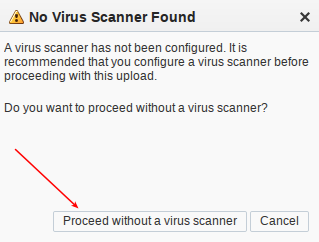

- Select the wallet you downloaded in Lab 100.

  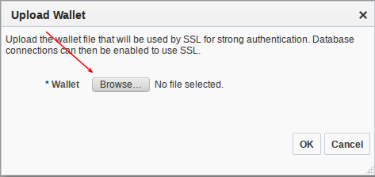

  

  

- Create new connection.  You will need to get the details for the connection in the tnsnames.ora file that was in the wallet.  Open the tnsnames.ora file.  Note the port, host, and service name.  These will be used to create new connection.  Leave the notepad open for the following steps.

  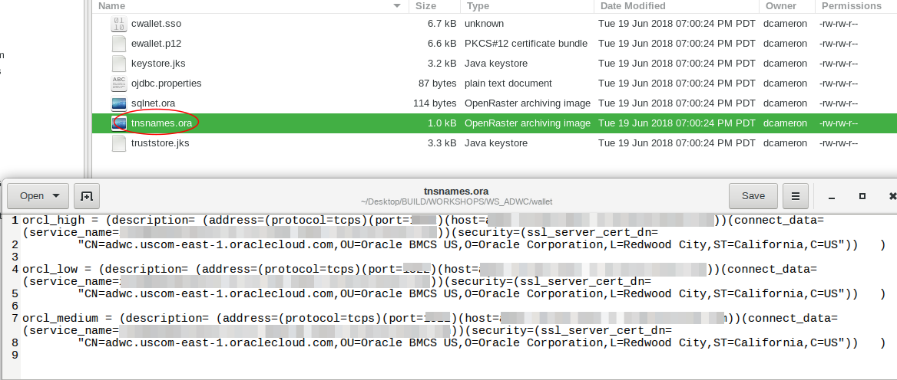

- Expand (if necessary) the menu on the left by clicking on the menu icon and select `Data` and then `Connections`.

  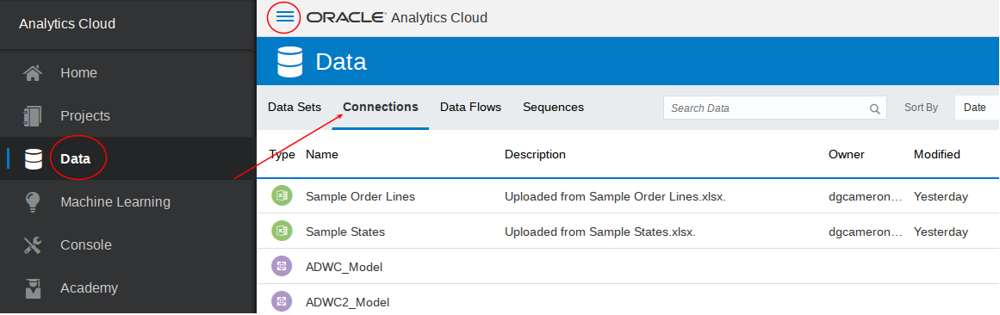

- Select `Create` and then C`onnection`.

  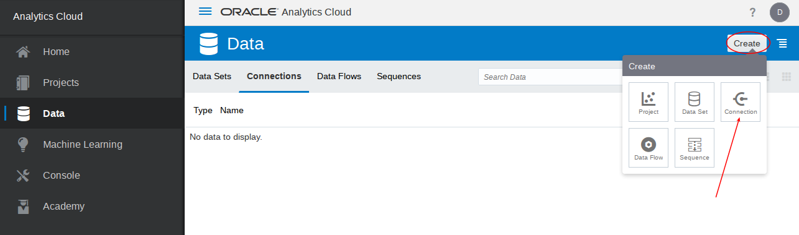

- Select `Oracle Autonomous Data Warehouse`.

  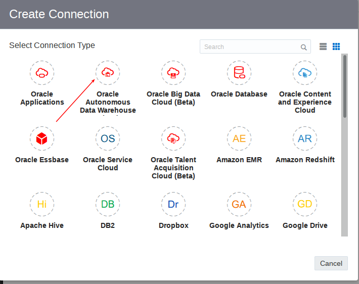

- Enter the following.  Obtain the details from the information you retrieved from the tnsnames.ora file above.

  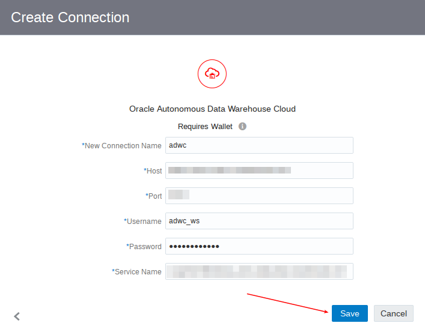

  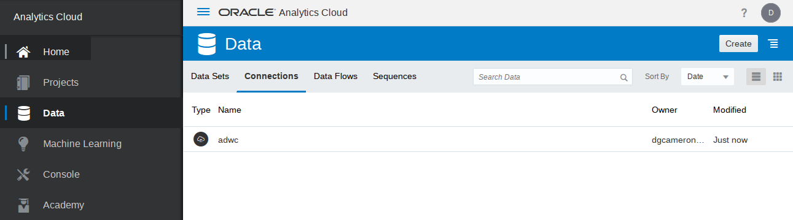

### **STEP 4: Create Data Sets.**

- Select the `Data Sets` tab and then select `Create`.

  

- Select the `adwc` connect you just created.

  

- Select the `ADWC_WS` schema.

  

- Select the `AI_EXPLAIN_OUTPUT_CREDIT_SCORE_BIN` table, then `Add All` and then `Add`.

  

  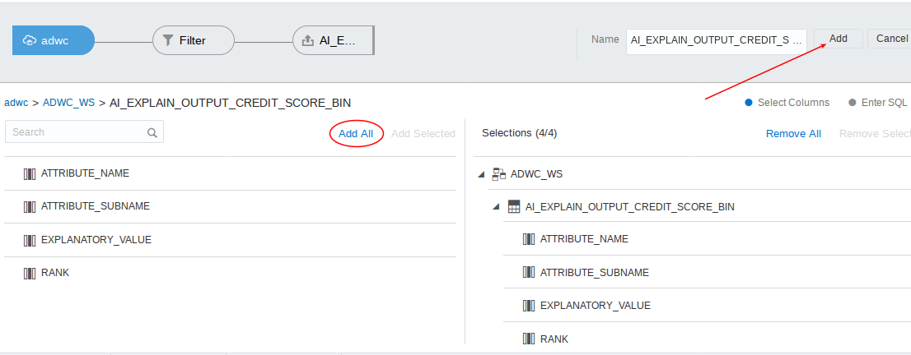

- Go back to the browser tab `Oracle Analytics Cloud` tab and create the next Data Set.

  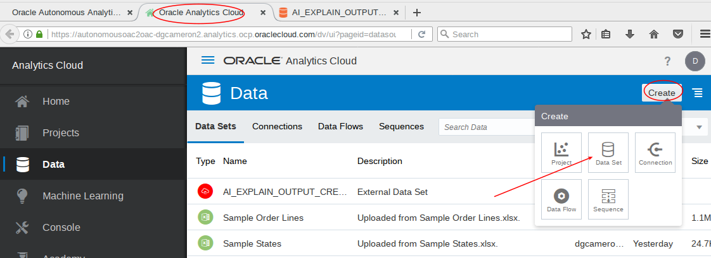

- Select the `adwc` data source and the `ADWC_WS` schema (as above), and then repeat the above steps for the following tables
  - `AI_EXPLAIN_OUTPUT_MAX_CC_SPENT_AMOUNT`
  - `CREDIT_SCORING_100K_V`
  - `CREDIT_SCORE_NEW_PREDICTIONS`
  - `N1_LIFT_TABLE`

- We need to make some adjustments to default table definitions.  Hover over the `N1_LIFT_TABLE`, select the menu on the far right, and then select `Inspect`.

  

- Change the first attribute `QUANTILE_NUMBER` to an attribute.

  

  

- Next update `CREDIT_SCORE_NEW_PREDICTIONS` table, select `Inspect`, and change all the columns to `Attribute` (many are already this value).  You will need to scroll down to change them all.

  

  

- Lastly, update CREDIT_SCORING_10OK_V and set all values to `Attribute`.

  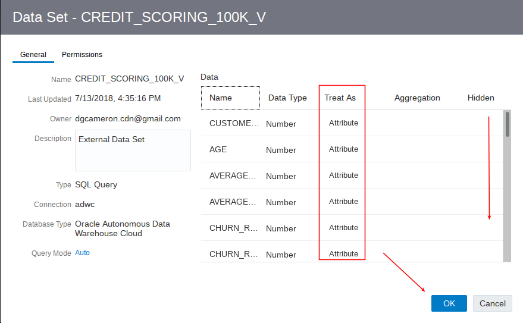

### **STEP 5: Create Good Credit Factors Analysis.**

- Select `Projects` on the left, then `Create`.

  

- Hold the shift key down and select the following tables to add to our new project.

  

- Drag `ATTRIBUTE_NAME` and `EXPLANATORY_VALUE` from `AI_EXPLAIN_OUTPUT_CREDIT_SCORE_BIN` to the canvas.

  

- Next right click on `RANK` and select `Create Filter`.  Enter `0` for Start and `10` for End.

  

  

- Next right click on `EXPLANATORY_VALUE` and sort high to low.

  

- Rename `Canvas 1` to `Good Credit Factors`.

  

  

- Save our new project.  Click in the upper right and save the project as `Credit Risk Analysis`.

  

  

### **STEP 6: Create Max CC Limit Analysis.**

- Note this analysis is very similar to the one above.  Click on the + symbol on the bottom of the page to create a new Canvas.

  

- Select the following fields and drag them on to the canvas.

  

- Create filter by right clicking on the `RANK` attribute.  Enter `Start` of `0` and `End` of `10`.

  

  

- Right click on `EXPLANATORY_VALUE` and sort high to low.

  

- Rename this canvas `Max CC Limit`.

  

  

### **STEP 7: Cumulative Lift Analysis.**

- Create a new Canvas and then under N1_LIFT_TABLE right click on My Calculations and create a new one.

  

  

- Call the calculation `Chance` and enter `RSUM(.01)`.

  

- Drag the following fields to the canvas.

  

- Change the visualization to a line chart and move the three values (`Chance`, `QUANTILE_NUMBER`, and `GAIN_CUMULATIVE`) to the postions noted below.

  

- Click on the visualization pallet on the far left and select Text Box.  Drag this to a position above the chart.

  

- Double click on the text box and enter `Cumulative Lift`.  Then hightlight the text and set the font to 20.

  

- Double click on the text box again and enter the following.  Set the font size to 12:
```
Cumulative lift is a measure of how much better prediction results are using a model than could be obtained by chance. For example, suppose that 2% of the customers mailed a catalog make a purchase; suppose also that when you use a model to select catalog recipients, 10% make a purchase. Then the lift for the model is 10/2 or 5. Lift may also be used as a measure to compare different data mining models. Since lift is computed using a data table with actual outcomes, lift compares how well a model performs with respect to this data on predicted outcomes. Lift indicates how well the model improved the predictions over a random selection given actual results. Lift allows a user to infer how a model performs on new data.
```
- Change the Canvas name to `Cumulative Lift`.

  

  

- Save your project periodically.

  

### **STEP 8: Create Demographic Analysis.**

- Right click on the `+` icon at the bottom of the page and create a new canvas, then right click on `My Calculations` under `CREDIT_SCORE_NEW_PREDICTIONS` and create a new calculation.

  

- Call the calculation `Row Count` and double click on `Count*` under `Aggregate`.

  

  

- Expand `CREDIT_SCORE_NEW_PREDICTIONS` and select `PROB_GOOD_CREDIT` and `Row Count`.  Drag these onto the canvas.

  

- Change the visualization to  `Table` and then right click on `PROB_GOOD_CREDIT` and select `Create Filter`.

  

- Select all values below 50, and then right click on the hamburger menu and select `Exclude Selections`.

  

- Select the visualization menu on the far left and select a new pie chart visualization

  

- Drag it to the right.

  

- Click on the pie chart area, and then on the data elements icon on the far left, and drag the items as follows.

  

- Click ont the pie chart and set `Data Values` on the left to values.

  

- Optional - right click on items and select `CREATE FILTER`.

  

- Select the visualization icon on the left,scroll down and select `Text Box` and drag that to the top.  

  

- Double click inside the text box and enter the title `Probability of Good Credit Given Various Demographic Factors`.  Set the font size to 20.  Then add the following: `This shows the probability of good credit for various demographic factors.  Adjust the filters above to gain an understanding of what is likely to result in good credit.`

  

- Name the canvas `Demographic Analysis`.

  

### **STEP 9: Analyze Other Factors in the Credit Scoring Data.**

We have been looking at a sub-set of the factors used to predict good credit, which are in the `CREDIT_SCORE_NEW_PREDICTIONS` table.  We will analyze other factors in the `CREDIT_SCORING_100K_V` data set so we can use any of the large number of other factors that were processed.

- Create a new canvas, expand the `CREDIT_SCORING_100K_V` on the left, and drag `PROB_GOOD_CREDIT`, `Row Count`, and `Credit History` onto the canvas.  Set the visualization to `Pivot`.

  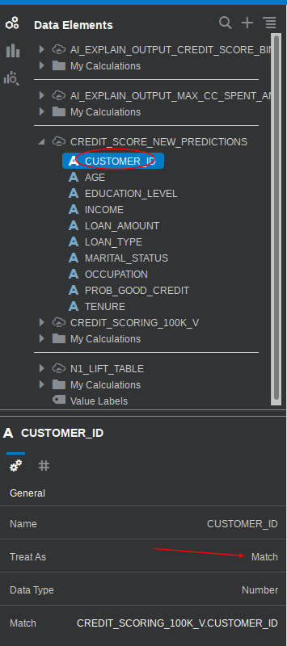

- Add a filter on `PROB_GOOD_CREDIT`.  Right click on the field and then click on all values over 50.  

  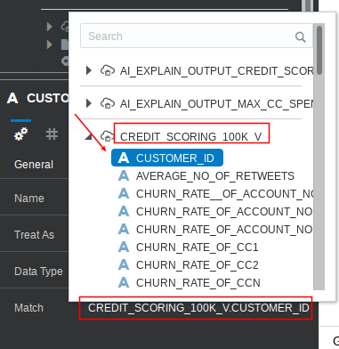

  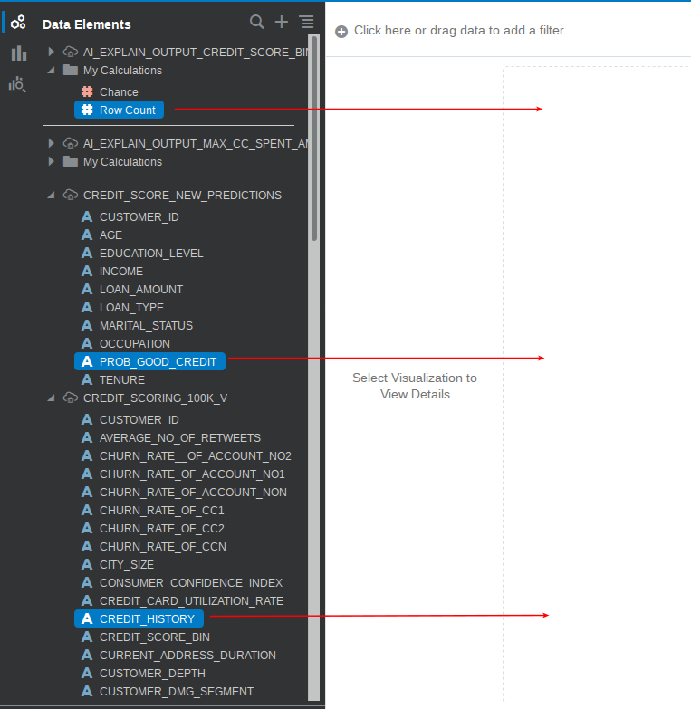

- Also right click on `CREDIT_HISTORY` and click outside the box to default to selecting all values.

  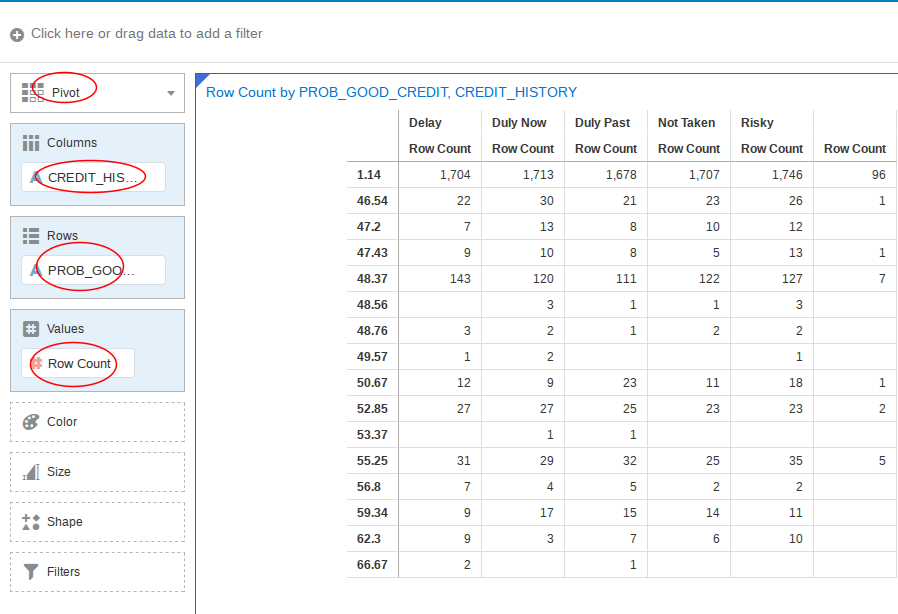

  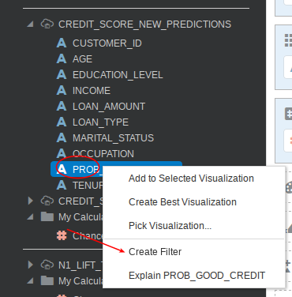

  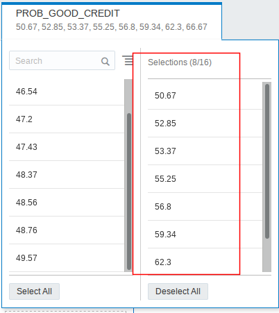

- Next add a new visualization - select treemap and drag it to underneath the pivot table.

  

- Select the Treemap visualization and then select data elements.  Drag the items as follows:

  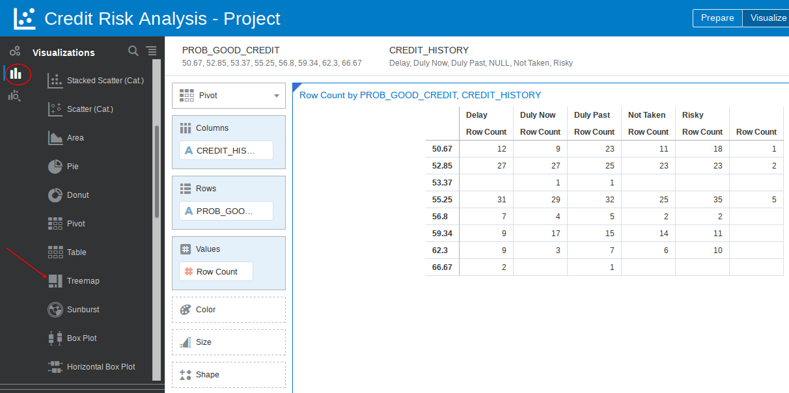

### **STEP 10: Explore Other Interesting Visualizations That Help Better Understand the Information.**

- Create a new canvas.  Drag `FAMILY_SIZE`, `PROB_GOOD_CREDIT`, and `ROW_COUNT` onto the canvas.  Select `Network` as the visualization.  

  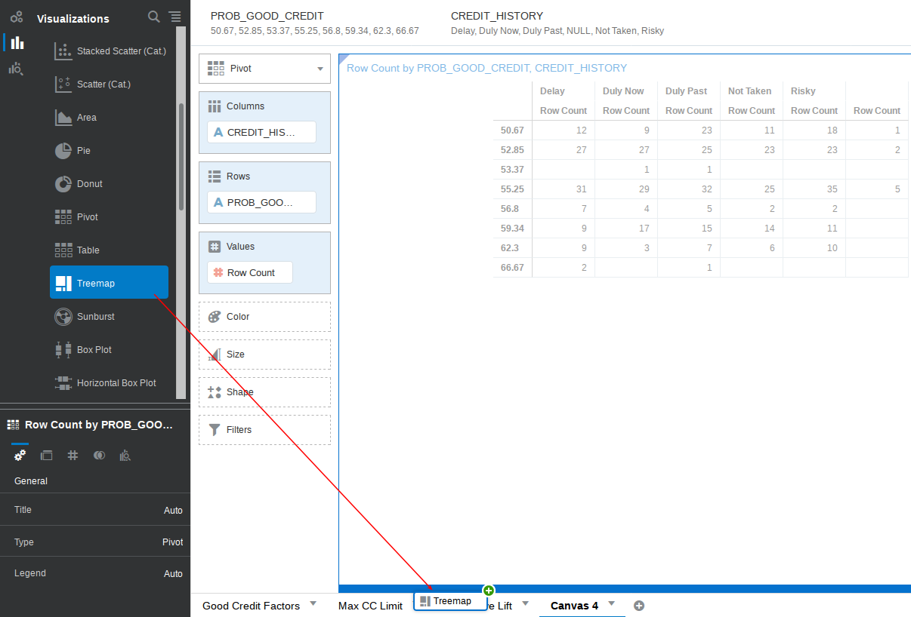

- Since we want to focus on higher probabilies, create a filter on `PROB_GOOD_CREDIT` and select everything over 50.

  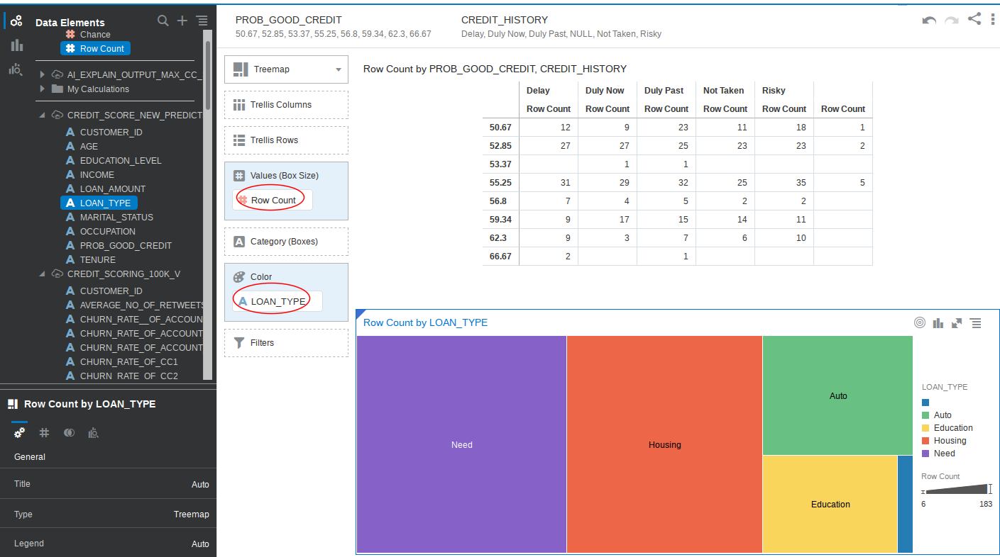

  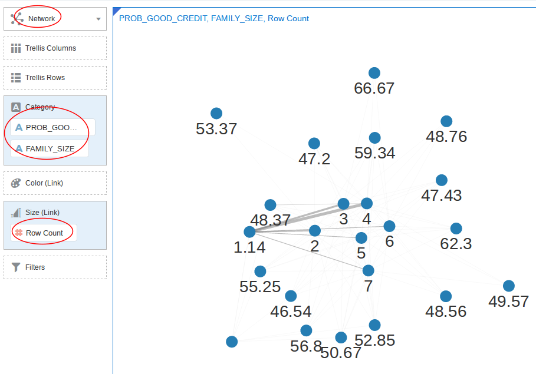

  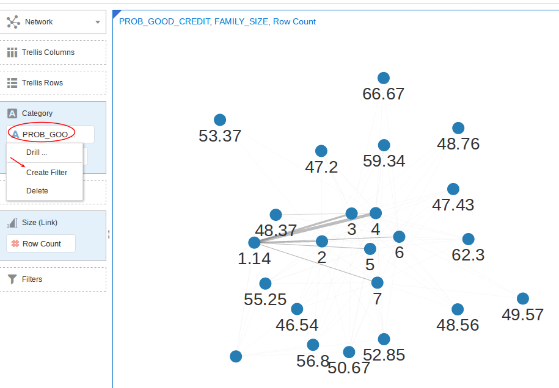

- Lets add one more dimension - `RESIDENTIAL STATUS`.  Drag this to `Category`

  

- Now focus on those with near perfect predictability for Good Credit.  Right click on the 100 node and select `Keep Selected`.

  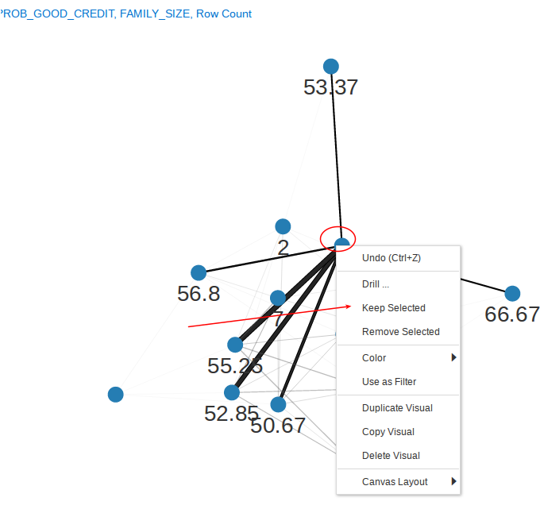

  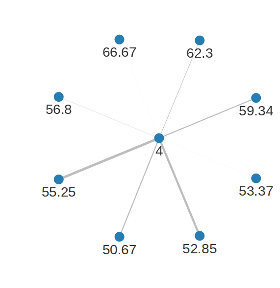

- This tells us that customers that are home owner with 2 - 3 children generally have good credit.

- At this point we can drill to the individual customer_ids and execute a marketing campaign, or do further analysis.  The wide variety of visualizations combined with Oracle Machine Learning offer endless ways to identify interesting data patterns that support a wide variety of business applications.  In this case Emma can focus her limited marketing budget on activities that maximize the effectiveness of sales promotions. 