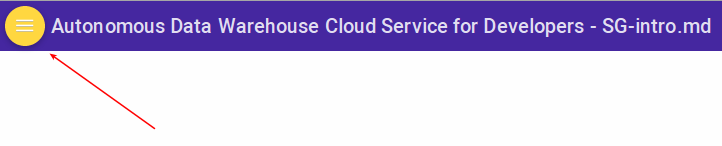
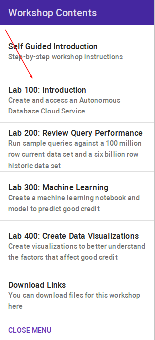

# Autonomous Data Warehouse Cloud Service For Developers

Welcome to the Autonomous Data Warehouse Cloud Service for Developers workshop.  These labs will give you a basic understanding of the Autonmous Data Warehouse Cloud Service and how it vastly simplifies management of data and development of applications that access large volumes of data. Lab 100 will introduce you to ADWC and show you how to create a ADWC service. Lab 200 will show how developers and dbas can access billions of rows of data in seconds without needing to design in performance. Lab 300 shows you you can use ADWC's Machine Learning to predict outcomes of business events.  Finally lab 400 shows how you can visualize patterns in data, and run ad-hoc queries to discover patterns in the data.

## Acquire an Oracle Cloud Trial or Workshop Account

Please click on the [Free Oracle Cloud Promotion](https://myservices.us.oraclecloud.com/mycloud/signup?language=en&sourceType=:ex:tb:::RC_NAMK180711P00050:DBCS_OCI_HOL&SC=:ex:tb:::RC_NAMK180711P00050:DBCS_OCI_HOL&pcode=NAMK180711P00050) link to complete all the required steps to get your free Oracle Cloud Trial Account. When you complete the registration process you'll receive a $300 credit and up to 3500 hours of free Oracle Cloud usage. You'll have 1000s of hours left over after the labs to continue to explore the Oracle Cloud.  Soon after requesting your trial you will receive the following email. You will not be able to start Lab 100 until you have received it.

## Navigate to Lab 100

- Once the setup is complete you can move on to lab 100 by clicking on the Menu Icon in the upper left corner of the browser window. You're now ready to continue with Lab 100.

  

